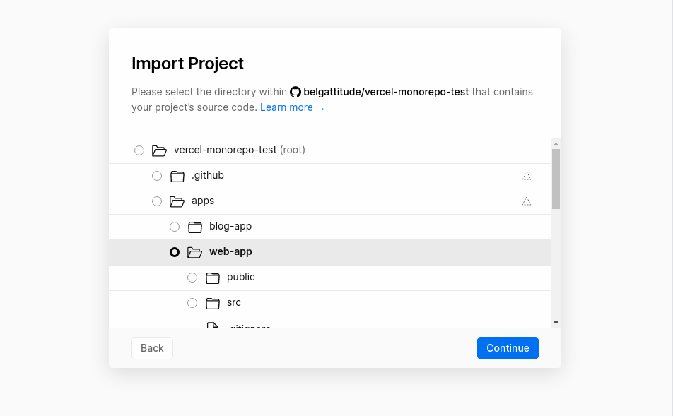
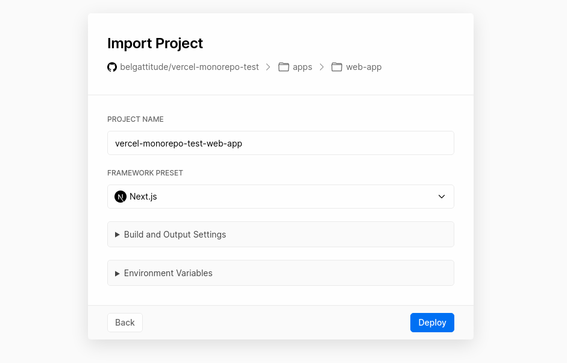
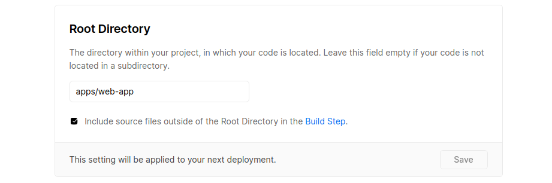

# NextJS monorepo example

Using recent [vercel monorep support](https://vercel.com/blog/monorepos). ([docs](https://vercel.com/docs/git-integrations#monorepos)).

Two apps deployed:

- apps/public-app: https://vercel-monorepo-test-web-app.vercel.app/ (SSG - with getStaticProps)
- apps/blog-app: https://vercel-monorepo-test-blog-app.vercel.app/ (SSR - with Api-routes)

Both uses packages relying on yarn workspaces and illustrate two methods to allow transpilation. 

- @your-org/ui-lib: shared with typescript baseUrl resolution initiated in [#13542](https://github.com/vercel/next.js/pull/13542) 
- @your-org/core-lib: shared with [next-transpile-modules](https://github.com/martpie/next-transpile-modules)

### Structure

Two nextjs apps: apps/blog-app and the apps/web-app. 
Two shared packages: packages/bar and packages/foo.  

```
.
├── apps
│   ├── blog-app                 (NextJS SSG app)
│   │   ├── src/
│   │   ├── next.config.js
│   │   ├── package.json
│   │   └── tsconfig.json       (extends base config)
│   ├── web-app                 (NextJS app with api-routes)
│   │   ├── src/
│   │   ├── next.config.js
│   │   ├── package.json
│   │   └── tsconfig.json       (extends base config)
├── packages
│   ├── bar                     (Shared with tsconfig path resolution, publishable with microbundle)
│   │   ├── src/
│   │   ├── package.json
│   │   └── tsconfig.json       
│   ├── foo                     (Shared with next-transpile-modules)
│   │   ├── src/
│   │   ├── package.json
│   │   └── tsconfig.json       
├── package.json                (the workspace config)
└── tsconfig.base.json               (base typescript config)
```

### How to

#### Config

- Declare your workspaces paths in [package.json](./package.json)

1. For typescript config base path:

- In [tsconfig.base.json](tsconfig.base.json) at the root.
  Set `baseUrl` to '.' and define your dependencies in `paths`.
- Configure webpack in [next.config.js](./apps/web-app/next.config.js)

2. For next-transpile-module

- Define your shared packages in your apps, i.e: [next.config.js](./apps/web-app/next.config.js)
- Your shared packages have to indicate a `main` field *(since next-transpile-modules v6)*, i.e: 
  [package.json](packages/core-lib/package.json). 


3. For deployments

- Be sure you build as 'serverless' to benefit from vercel monorepo support. 

#### Vercel

When importing the repo, set the name of the app (i.e blog-app) and be sure
to override development settings are like this:





### Pros/Cons

@your-org/ui-lib is shared through typescript baseUrl resolution improvements from [#13542](https://github.com/vercel/next.js/pull/13542) 
(rather than next-transpile-module). 

| Support matrix        | tsconfig paths | next-transpile-module |
|-----------------------|----------------|-----------------------|
| Typescript            | ✅              | ✅                    |
| Javascript            | ✅              | ✅                    |
| NextJs Fast refresh   | ✅              | ✅                    |
| CSS                   | ❌              | ✅                    |
| SCSS                  | ❌              | ✅                    |
| CSS-in-JS             | ✅              | ✅                    |
| ts-jest               | ✅              | ?                    |
| Vercel monorepo       | ✅              | ✅                    |
| Yarn 2 PNP            | ✅              | ❌                    |
| Experimental webpack5 | ?               | ❌  (working on it)  |
| Publishable (npm)     | ✅               | ❌  (cause they rely on "main")  |


#### Advantages over next-transpile-modules

- Fast refresh works out of the box, see https://github.com/martpie/next-transpile-modules/issues/9 and `resolveSymlinks` that
  can help. 
- ts-jest should honour the config.

#### Advantages of next-transpile-modules

- It handles css/scss as well


### Notes

- Monorepos are not monoliths, this approach is for sanity while developing and using sandboxes 
  (a scenario where you generally don't want to version and publish your shared packages). 
- You might have to create multiple tsconfig.json (i.e: tsconfig.dev.json, tsconfig.build.json...) if you 
  want to use a distributed package rather than transpiling. 
- Better to keep all deps at the same version. You might run into problem if one package depends a v1 version and another in a v2.
  (There's a script to check that `yarn deps:check`)
  

### Links

- RFC: https://github.com/vercel/next.js/discussions/15327
- Vercel monorepo support: https://github.com/vercel/vercel/issues/3547#issuecomment-673687255


