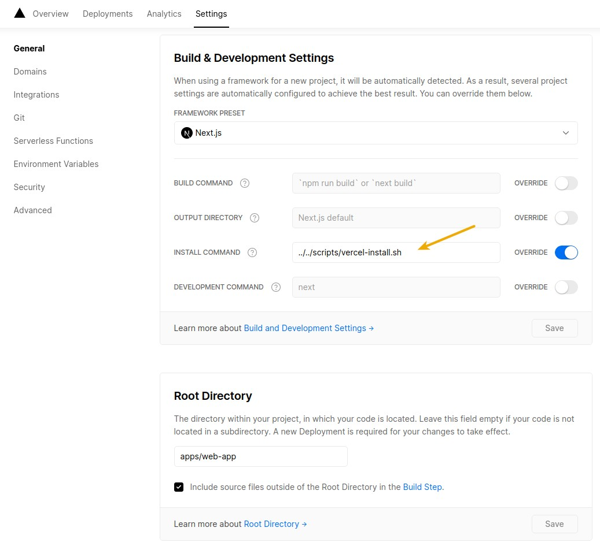

# Vercel

## How to deploy a monorepo on Vercel ?

Vercel supports it natively, so there's pretty much nothing to do.

## Steps

1. Select the app
   
2. Choose the name
   

3. (Option) To speed up install step and allow yarn 2 cache strategy till it's supported natively
   by Vercel, use a workaround by overriding install step with `YARN_CACHE_FOLDER=./.next/cache/yarn-cache yarn install`.

   
